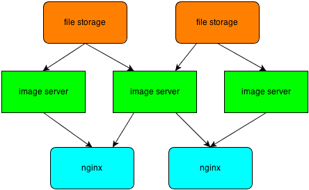

# 缩略图架构实现

笔者最近将缩略图功能引入了私有云系统中，这里简单记录一下。

## 架构

整体架构如下：

可以看到，笔者采用了通用的分层架构设计模式。

- file storage存放着原始的图片数据。
- image server用于图片的处理，同时进行图片的cache。
- nginx作为统一的入口，同时也作为cache。

当用户请求一张图片的缩略图的时候，如果该图片不存在于nginx的缓存中，则nginx根据图片的fileid 通过consistent hash路由到对应的image server上面去处理，如果image server仍然没有该图片，则会从file storage下载。

分层架构有一个很好的地方在于系统的可扩展性，同时我们也可以在加入一些中间层，提高cache的命中率，譬如我们就可以在image server与nginx之间引入一个cache层。不过鉴于我们的系统主要用于企业内部，不会出现图片数据量过大的情况，所以上面这套分层设计已经足够了。

### nginx try_files

如果本地cache不存在，则去后台服务器取数据。对于这套逻辑，nginx可以通过try_files很好的处理，譬如:

    location /abc.png {
        root /data/image/;
        try_files $uri @fetch;
    }
    
    location @fetch {
        proxy_pass http://up_imageserver$request_uri;
    }
   
首先try_files会尝试在本地获取对应的文件，如果没有找到，则会内部跳转到fetch这个location去远程获取数据。

## 何时处理缩略图

既然是缩略图，那么何时生成缩略图就是需要考虑的问题了。通常来说，缩略图的生成会有两种方式：

- 上传生成

    当用户上传一张图片之后，系统自动为该图片生成对应的固定格式缩略图，然后将原图与缩略图一起存放到file storage里面去。这方面主要有facebook的[Haystack](http://static.usenix.org/event/osdi10/tech/full_papers/Beaver.pdf)系统。
    
- 实时生成

    当用户上传一张图片之后，只保留该图片的原始数据，当请求该图的缩略图时，如果cache中不存在，由image server动态生成。这方面可以参考淘宝的图片存储介绍。
    
对于笔者来说，实际使用的是第二种方法，主要有以下几个原因的考量：

- 对于实时生成的缩略图我们可以灵活的指定其大小，而不像上传生成那样只有预先定义的width和height。
- 存储成本，额外存储缩略图会占用很大的存储空间，而且存放到file storage里面还会有冗余备份的问题，更加浪费。
- 协同图片的冷热性问题，最近最热的图片铁定是最频繁访问的，尤其是在多人协同情况下面，而这些图片缩略图是有缓存的，不需要每次都通过原图生成，性能有保证。

## 如何处理缩略图

既然选择实时生成缩略图，那么如何快速生成缩略图就是笔者需要考虑的问题了。这里笔者使用[graphicsmagick](http://www.graphicsmagick.org/)来生成缩略图，网上有太多介绍，这里不再累述。

## 安全

生成缩略图之后，如何保证该图片的安全访问也是一个需要关注的问题。笔者考虑了如下解决方案：

- 签名，任何缩略图的url都是经过签名，因为签名是通过登陆用户自身的access id和security key进行的，并且有时效性，所以外界很难伪造。或者，可以使用简单的[HttpAccessKeyModule](http://wiki.nginx.org/HttpAccessKeyModule)来进行访问控制。

- nginx [HttpRefererModule](http://wiki.nginx.org/HttpRefererModule)，只允许特定domain的请求访问。

## 存储

对于如何存储大量的图片小文件，笔者觉得可以如下考虑：

- 对于文件最终存放的file storage，业界有很多好的分布式解决方案，譬如[TFS](http://code.taobao.org/p/tfs/src/)，[mogilefs](https://github.com/mogilefs)等，如果想自己造一个轮子，也很不错。
- 对于图片的cache，因为cache的存储文件量级我们是可以控制的，所以这里可以考虑直接使用通常的文件系统存储。
    
    但需要注意的是，单个目录下面文件数量不能过多，目录的层次也不能过深，不然会导致很严重的性能瓶颈。为了解决上述问题，笔者建立了三层目录结构，首层100个文件夹，以1 - 100命名，每个文件夹下面1000个文件夹，以1 - 1000命名，对于任意的图片文件，根据其实际的文件名通过两次hash到特定的目录下。
    

版权声明：自由转载-非商用-非衍生-保持署名 [Creative Commons BY-NC-ND 3.0](http://creativecommons.org/licenses/by-nc-nd/3.0/deed.zh)
